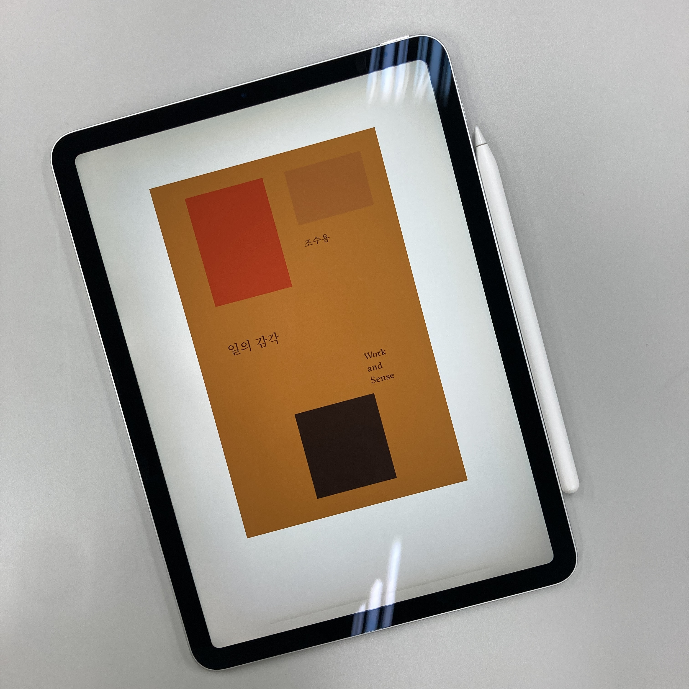

**네이버 초록 검색창, 나눔 글꼴, 사운즈 한남, 영종도 네스트 호텔, 매거진 B.**

언뜻 보기에 어떤 공통점이 있나 싶지만, 이 키워드들은 조수용이라는 인물을 관통한다. 기획, 설계, 디자인까지 그의 손을 거쳐간 결과물들이다. (물론 모든 작업을 혼자서 했다는 뜻은 아니다.)

미대 출신인 저자가 한국의 대표적인 IT 회사의 경영인이자 잡지 발행인까지 될 수 있었던 배경은 무엇일까. 단지 디자인을 잘하는 것만으로는 어려운 일이다.

그는 이 책에서 오너십(Ownership)을 강조한다. 오너십은 스스로 책임지고 끝까지 완수하려는 자세를 뜻한다. 미대생 시절, 디자인 아르바이트를 할 때에도 클라이언트가 요구하는 대로 디자인만 하는 것이 아니라 클라이언트의 입장에서 고민하고 조언해주었다고 한다.

저자의 말을 잠시 들어보자.

> 어떤 때는 ‘제품부터 다시 만들어야 하지 않느냐, 이 제품은 경쟁력이 없는데 지금 디자인이 웬말이냐’라며,클라이언트에게 불편한 소리를 할 때도 있었습니다.

조수용 작가가 대학생이었던 시절, 집안 형편이 넉넉하지 못해 직접 학비를 벌어야 하는 상황이었다고 한다. 만약 내가 저자와 비슷한 처지였다면 저런 말을 할 수 있었을까 하는 생각이 들었다. 설령 그런 상황이 아니더라도 클라이언트가 불편할 만한 이야기를 꺼내는 것은 쉽지 않은 일이다.

그가 얼마나 확고한 오너십을 가지고 일을 해왔는지 보여주는 부분인 것 같아 인상 깊었다.

오너십에 기반한 업무 태도는 네이버 디자이너였던 그를 브랜드 경험 디자인(Brand Experience Design) 팀의 수장으로 끌어올렸다. 그리고 자신이 더이상 오너십을 가지고 일을 할 의미를 찾지 못했을 때 미련없이 회사를 나왔다.

사실 조수용 작가를 처음 본 것은 ‘최성운의 사고실험’이라는 유튜브를 통해서였다. 이해하기 쉽게 말하면서도 상식이라 여겼던 것들을 다시 생각하게 해주어서 좋았다. 이 책도 그렇다. 일정 부분 내용이 겹치긴 하지만, 읽기 쉽고 따로 기록해두고 싶은 내용도 많다. 이 글을 읽고 저자에게 관심이 생겼다면 유튜브를 먼저 시청하는 것도 추천한다.

\* 도서 링크: https://product.kyobobook.co.kr/detail/S000214758045   \* 유튜브 링크: https://youtu.be/FLoUGGq38lA?si=dhjdcTupARukk-XJ
